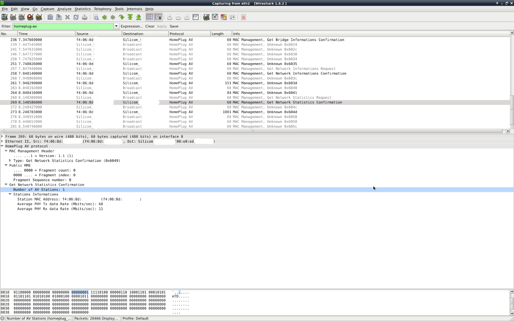

# good things first

If you need something well tested have a look at: https://github.com/qca/open-plc-utils

# why?

- constant trouble with my DEVOLO DLAN 550+ Homeplug AV adapters (unstable connection under high load) & I don't trust the vendor tool that tells me 'everything is fine' - even if sh*t is on fire
- liked to learn more about that basic technology

# normative references

IEEE 1901-2010 - IEEE Standard for Broadband over Power Line Networks: Medium Access Control and Physical Layer Specifications

It is non free. You can buy it [here](https://standards.ieee.org/findstds/standard/1901-2010.html). 

Or check your next university library - they may offer access to norms and standards (e.g. in Germany check for access to the Perinorm database). 


# used abbreviations

|abbrev|meaning|
|------|---|
|BSS   | basic service set, group of synchronized stations
|BM    | basic service set manager, device that acts as a station and offers management, security and quality services to the BSS
|NID   | network identifier, 54 bit / 7 octets number identifying (together with the SNID) the BSS network
|NKM   | network membership key, BSS specific encryption key
|SNID  | short network identifier, 8 bit number (4 bit - ident, 4 bit - location indicator access/home/unknown) identifying (together with the NID) the BSS network
|TEI   | terminal equipment identifier, number that identifies a station (uint8 for in-home stations)
|DA    | destination address
|SA    | source address
|ODA   | original destination address, (original) destination MAC address of a frame
|OSA   | original source address, (original) source MAC address of a frame
|LMA   | local management address (00:b0:52:00:00:01), only address station(s) directly accessible (do not forward requests)
|PHY   | physical layer
|MPDU  | MAC protocol data unit - the unit of data exchanged between two peer MAC entities using the services of the physical layer
|SACKS | number of MAC protocol data units that were successfully acknowledged
|PBS   | number of physical layer blocks handed over to the PHY for transmission

# build the binaries

this project requires
- libevent (http://libevent.org/)
- cmoka (https://cmocka.org/)

```
> mkdir build
> cd build
> cmake ..
> make
```

# loop-mm-types

This is a test tool that just sends requests to ff:ff:ff:ff:ff:ff for all message types defined in IEEE 1901-2010 via the given interface.
The payload of all messages is set to zero, message size is 60 bytes.

By using the localcast oda/dst-MAC 00:b0:52:00:00:01 (option *-l*) only the local (=next) Homeplug AV device should respond.

You may run Wireshark or any other network capture tool on the same interface to intercept the reaction of
Homeplug AV devices in your network as this tool does not handle any received message.


```
> sudo bin/loop-mm-types eth2
```



supported command line parameters:
```
  -0, --v1-0                 use version homeplug av 1.0
  -1, --v1-1                 use version homeplug av 1.1 (default)
  -b, --broadcast            set oda to ff:ff:ff:ff:ff:ff (default)
  -c, --confirm              send confirm messages
  -d, --oda=DST-MAC          set oda to given mac address
  -i, --indication           send indication messages
  -l, --localcast            set oda to Qualcomm Atheros LMA 00:b0:52:00:00:01
  -r, --request              send request messages (default)
  -R, --response             send response messages
  -v, --verbose-send         show send messages types and operations
  -?, --help                 Give this help list
      --usage                Give a short usage message
```


# hpav-discover

As the name implies this tool can be used to discover Homeplug AV devices in the local network.
This is done by sending a CC_DISCOVER_LIST (0x014) to ff:ff:ff:ff:ff:ff (you may use other destination-MAC-addresses - see options below). By default the tool sends also a CM_NW_INFO (0x6038) message to request network information from discovered devices.


```
> sudo bin/hpav-discover eth2
discovered-station_0:
  osa: f4:06:8d:XX:XX:56
  mac: f4:06:8d:XX:XX:54
  tei: 0x01
  snid: 0x01
  same-network: yes
nwinfo_0:
  osa: f4:06:8d:XX:XX:56
  bm-mac: f4:06:8d:XX:XX:54
  tei: 0x36
  nid: ee:d0:XX:XX:XX:XX:06
  snid: 0x01
  access: in home
  role: station
discovered-station_1:
  osa: f4:06:8d:XX:XX:54
  mac: f4:06:8d:XX:XX:56
  tei: 0x36
  snid: 0x01
  same-network: yes
nwinfo_1:
  osa: f4:06:8d:XX:XX:54
  bm-mac: f4:06:8d:XX:XX:54
  tei: 0x01
  nid: ee:d0:XX:XX:XX:XX:06
  snid: 0x01
  access: in home
  role: basic service set manager
```

The output of the example above shows that
- there a two devices (f4:06:8d:XX:XX:54 and f4:06:8d:XX:XX:56)
- they share the same network (nid: ee:d0:71:XX:XX:XX:06 / snid: 0x01) 
- the network is coordinated by f4:06:8d:XX:XX:54 (bm - basic service set manager)
- f4:06:8d:XX:XX:56 acts as station

derived topology:
```
  +----+   +-----------------+                      +-----------------+
  | PC |---|f4:06:8d:XX:XX:56| ~~~~ POWER LINE ~~~~ |f4:06:8d:XX:XX:54|
  +----+   +-----------------+                      +-----------------+
                STATION                                 STATION + BM
```

supported command line parameters:
```
  -0, --v1-0                 use version homeplug av 1.0
  -1, --v1-1                 use version homeplug av 1.1 (default)
  -b, --broadcast            set oda to ff:ff:ff:ff:ff:ff (default)
  -d, --oda=DST-MAC          set oda to given mac address
  -l, --localcast            set oda to Qualcomm Atheros LMA 00:b0:52:00:00:01
  -n, --no-nwinfo            don't request nwinfo for each discovered station
  -N, --numeric-output       show numeric values instead of translated strings
  -?, --help                 Give this help list
      --usage                Give a short usage message
```

# hpav-stats

This tool is the workhorse as it requests the network and link statistics (by default both stats are requested,
you may query network stats [option *-N*] or link stats [option *-L*] only).

The network stats are requested by sending a MM_TYPE_CM_NW_STATS message (0x6048) to the configured 
ODA (defaults to ff:ff:ff:ff:ff:ff, could be set to any MAC or LMA).

Example for network stats request only for the local device (ODA=00:b0:52:00:00:01):
```
> sudo ./hpav-stats -l -N eth2
network_stats_0:
  ts: 1465506389
  osa: f4:06:8d:XX:XX:56
  destination-address: f4:06:8d:XX:XX:54
  avg-tx-rate: 62
  avg-rx-rate: 20
```

This reply was send by the device with the MAC address f4:06:8d:XX:XX:56 and contains the
average rx/tx speed for the connection to the device with the MAC address f4:06:8d:XX:XX:54.
Note that the reported values are the data-rate measured at the PHY.

The ts field contains the time the report was received.

Example for network stats request only for all accessible devices (ODA=ff:ff:ff:ff:ff:ff):
```
> sudo ./hpav-stats -N eth2
network_stats_0:
  ts: 1465506795
  osa: f4:06:8d:XX:XX:56
  destination-address: f4:06:8d:XX:XX:54
  avg-tx-rate: 62
  avg-rx-rate: 19
network_stats_1:
  ts: 1465506795
  osa: f4:06:8d:XX:XX:54
  destination-address: f4:06:8d:XX:XX:56
  avg-tx-rate: 19
  avg-rx-rate: 62
```

This is the response for a BSS containing two stations. Note the mirrored OSA, destination-address and rx/tx-rate values in the network_stats sections.

While the network stats are fine to check how slow the connection is, the link stats are useful to see why the powerline connection
behaves like a 14K modem. The request uses the message type CM_LINK_STATS (0x604C) an can be done either for the RX or TX direction
of each logical link channel identified by the lid (link ID). Usually only lid 0..3 (priority channels) are in use so these are the default channels a link stat request is send for (can be overridden by using parameter *-i <lid>*).

Since each station could be part of more then one BSS and communicate with more then one station
- the NID must be given to request the link stats for a specific network (option *-n*) and
- the DA-SA-MAC must be given (parameter *-m <MAC address>*) to select a destination address a device should report the link stats for.

Example: if you would like to get the link statistics for all links communicating with a device using the MAC f4:06:8d:XX:XX:54, you need to use this MAC with the parameter *-m* (if you recall the topology from above you may guess that we will only get replies from f4:06:8d:XX:XX:56):

```
> sudo ./hpav-stats -L -m f4:06:8d:XX:XX:54 -n ee:d0:71:XX:XX:XX:06 eth2  
transmit_link_stats_0:
  ts: 1465932952
  osa: f4:06:8d:XX:XX:56
  req-id: 0x01
  lid: 0x01
  rsp-type: 0x00
  beacon-period-cnt: 0
  tx-num-msduds: 0
  tx-octets: 0
  tx-num-segs: 0
  tx-num-seg-suc: 0
  tx-num-seg-dropped: 0
  tx-num-pbs: 94244
  tx-num-mpdus: 59229
  tx-num-bursts: 0
  tx-num-sacks: 56796
  num-lat-bins: 0
transmit_link_stats_1:
  ts: 1465932952
  osa: f4:06:8d:XX:XX:56
  req-id: 0x02
  lid: 0x02
  rsp-type: 0x00
  beacon-period-cnt: 0
  tx-num-msduds: 0
  tx-octets: 0
  tx-num-segs: 0
  tx-num-seg-suc: 0
  tx-num-seg-dropped: 0
  tx-num-pbs: 12033
  tx-num-mpdus: 10653
  tx-num-bursts: 0
  tx-num-sacks: 10302
  num-lat-bins: 0
transmit_link_stats_2:
  ts: 1465932953
  osa: f4:06:8d:XX:XX:56
  req-id: 0x03
  lid: 0x03
  rsp-type: 0x00
  beacon-period-cnt: 0
  tx-num-msduds: 0
  tx-octets: 0
  tx-num-segs: 0
  tx-num-seg-suc: 0
  tx-num-seg-dropped: 0
  tx-num-pbs: 486
  tx-num-mpdus: 498
  tx-num-bursts: 0
  tx-num-sacks: 428
  num-lat-bins: 0
receive_link_stats_0:
  ts: 1465932954
  osa: f4:06:8d:XX:XX:56
  req-id: 0x01
  lid: 0x01
  rsp-type: 0x00
  beacon-period-cnt: 0
  rx-num-msduds: 0
  rx-octets: 0
  rx-num-seg-suc: 0
  rx-num-seg-missed: 0
  rx-num-pbs: 446018
  rx-num-bursts: 0
  rx-num-mpdus: 111471
  num-icv-fails: 0
receive_link_stats_1:
  ts: 1465932954
  osa: f4:06:8d:XX:XX:56
  req-id: 0x02
  lid: 0x02
  rsp-type: 0x00
  beacon-period-cnt: 0
  rx-num-msduds: 0
  rx-octets: 0
  rx-num-seg-suc: 0
  rx-num-seg-missed: 0
  rx-num-pbs: 584887
  rx-num-bursts: 0
  rx-num-mpdus: 515983
  num-icv-fails: 0
```

A freaking bunch of information - and this is only one side of a bi-directional communication association between two stations :)...
...you may skipp forward to the section 'hpav-stats-wrapper and tool'.

supported command line parameters:
```
  -0, --v1-0                 use version homeplug av 1.0
  -1, --v1-1                 use version homeplug av 1.1 (default)
  -a, --all-lids             query full lid range 0..255 (this may take some
                             time)
  -b, --broadcast            set oda to ff:ff:ff:ff:ff:ff (default)
  -d, --oda=DST-MAC          set oda to given mac address
  -g, --inter-message-gap=USEC   GAP between hpav-messages in micro seconds
                             (default: 200000)
  -i, --lid=LINK-ID          request link stats for given link id (default:
                             query LIDs 0..3 (priority links))
  -l, --localcast            set oda to Qualcomm Atheros LMA 00:b0:52:00:00:01
  -L, --link-stats           only request link statistics (default: req. nw and
                             link stats)
  -m, --link-stats-da-sa=DA-SA-MAC
                             destination/source MAC used for link stats query
  -n, --nid=NETZWORK-ID      network id to request the link-stats for (only
                             required for link stats)
  -N, --nw-stats             only request network statistics (default: req. nw
                             and link stats)
  -r, --link-stats-rx        only request link statistics for receive link
                             (default: req. both)
  -t, --link-stats-tx        only request link statistics for transmit link
                             (default: req. both)
  -?, --help                 Give this help list
      --usage                Give a short usage message
```

# hpav-stats-wrapper and tool

There is a python wrapper class (see HPAVStats in hpav_stats.py) that can be used to correlate the link statistics of two stations easily.
To demonstrate the usage of the wrapper it is used to query the link stats of two stations and calculate the MPDU/SACK deltas for all links:
```
# watch -n 1 python bin/hpav_stats.py --network-id ee:d0:71:XX:XX:XX:06 --sta-a-mac f4:06:8d:XX:XX:56 --sta-b-mac f4:06:8d:XX:XX:54 --interface eth2
f4:06:8d:XX:XX:56 ( <-> f4:06:8d:XX:XX:54)
    RX - LINK ID 2    RECEIVED MPDUS:      591 OTHER - SEND MPDUS:      606 RX-TX-DELTA:         -15 (-2.48%)
    RX - LINK ID 1    RECEIVED MPDUS:    55555 OTHER - SEND MPDUS:    60198 RX-TX-DELTA:       -4643 (-7.71%)
    TX - LINK ID 1    SEND MPDUS:       147468 ACKED MPDUS:          146466 SEND-ACK-DELTA:    -1002 (-0.68%)
    TX - LINK ID 2    SEND MPDUS:         2059 ACKED MPDUS:            1992 SEND-ACK-DELTA:      -67 (-3.25%)
f4:06:8d:XX:XX:54 ( <-> f4:06:8d:XX:XX:56)
    RX - LINK ID 2    RECEIVED MPDUS:     2016 OTHER - SEND MPDUS:     2059 RX-TX-DELTA:         -43 (-2.09%)
    RX - LINK ID 1    RECEIVED MPDUS:   146620 OTHER - SEND MPDUS:   147468 RX-TX-DELTA:        -848 (-0.58%)
    TX - LINK ID 1    SEND MPDUS:        60198 ACKED MPDUS:           55979 SEND-ACK-DELTA:    -4219 (-7.01%)
    TX - LINK ID 2    SEND MPDUS:          606 ACKED MPDUS:             594 SEND-ACK-DELTA:      -12 (-1.98%)
```

The output above shows the results for a pretty stable connection. The MPDUS (MAC protocol data unit) counters are taken from the RX and TX section
of station A and B (for each logical link). A high / growing delta indicates some kind of frame loss. Either the MPDUs send by B are lost or B didn't receive the
SACK (selective ACK) messages send by A. If the MPDU RX-TX-Delta is low but the SEND-ACK-DELTA grows, only the SACKS are missing. This would indicate an asymmetric
disruption of the communication channel. In case this happens to you just switch the HPAV devices and check if the issue stays on the same side of the topology as one
of your HPAV devices may be faulty.

For my setup link 1 of **tx**:f4:06:8d:XX:XX:54 -> **rx**:f4:06:8d:XX:XX:56 always shows some loss - but if I use another socket for my HPAV adapter in
the living-room I get a really bad connection:
```
> sudo python bin/hpav_stats.py --network-id ee:d0:71:XX:XX:XX:06 --sta-a-mac f4:06:8d:XX:XX:56 --sta-b-mac f4:06:8d:XX:XX:54 --interface eth2

f4:06:8d:XX:XX:56 ( <-> f4:06:8d:XX:XX:54)
    RX - LINK ID 2    RECEIVED MPDUS:     1375 OTHER - SEND MPDUS:     1533 RX-TX-DELTA:        -158 (-10.31%)
    RX - LINK ID 1    RECEIVED MPDUS:    20577 OTHER - SEND MPDUS:    21535 RX-TX-DELTA:        -958 (-4.45%)
    TX - LINK ID 1    SEND MPDUS:        46512 ACKED MPDUS:           45880 SEND-ACK-DELTA:     -632 (-1.36%)
    TX - LINK ID 2    SEND MPDUS:         2710 ACKED MPDUS:            2535 SEND-ACK-DELTA:     -175 (-6.46%)
f4:06:8d:XX:XX:54 ( <-> f4:06:8d:XX:XX:56)
    RX - LINK ID 2    RECEIVED MPDUS:     2565 OTHER - SEND MPDUS:     2710 RX-TX-DELTA:        -145 (-5.35%)
    RX - LINK ID 1    RECEIVED MPDUS:    45725 OTHER - SEND MPDUS:    46512 RX-TX-DELTA:        -787 (-1.69%)
    TX - LINK ID 1    SEND MPDUS:        21535 ACKED MPDUS:           20486 SEND-ACK-DELTA:    -1049 (-4.87%)
    TX - LINK ID 2    SEND MPDUS:         1533 ACKED MPDUS:            1371 SEND-ACK-DELTA:     -162 (-10.57%)
```

**Note 1:** There will always be a little delta of MPDUS/SACKS/... between station A and station B shown by the wrapper since the link statistics are collected sequentially.

**Note 2:** Make sure the HPAV adapters where started / plugged in at the same time since the counters are not cleared after readin them.

supported command line parameters:
```
  --interface INTERFACE     network interface used to communicate with the HPAV devices
  --network-id NETWORK_ID   network id to request the link stats for
  --sta-a-mac STA_A_MAC     MAC address of first station
  --sta-b-mac STA_B_MAC     MAC address of second station
  -h, --help                show a help message and exit
```